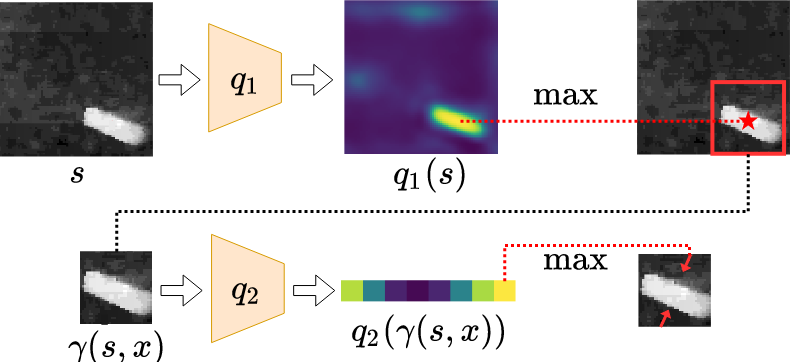
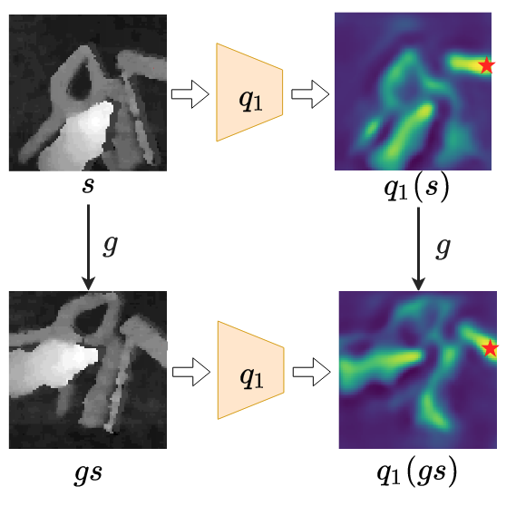
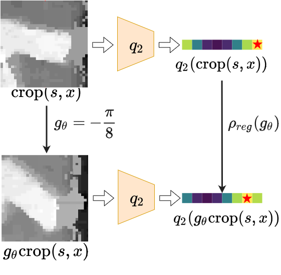
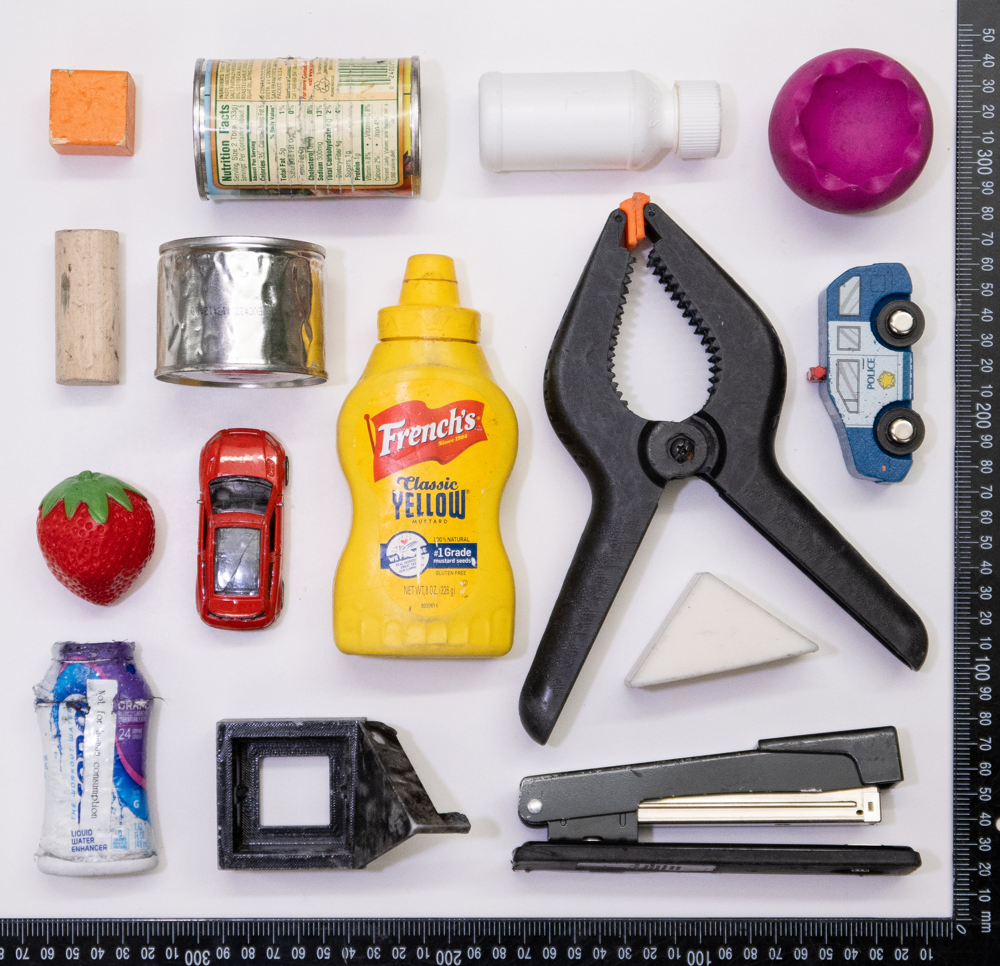
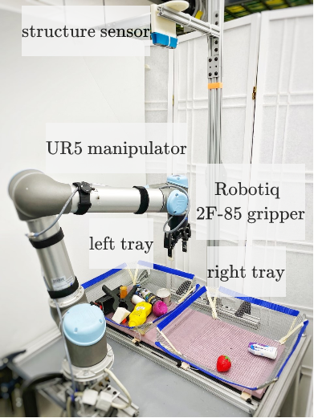

[Xupeng Zhu](), [Dian Wang](https://pointw.github.io), [Ondrej Biza](https://sites.google.com/view/obiza), [Guanang Su](),
[Robin Walters](http://mathserver.neu.edu/robin/), [Robert Platt](http://www.ccs.neu.edu/home/rplatt/)

## Citation
---

```
@misc{zhu2022sample,
      title={Sample Efficient Grasp Learning Using Equivariant Models}, 
      author={Xupeng Zhu and Dian Wang and Ondrej Biza and Guanang Su and Robin Walters and Robert Platt},
      year={2022},
      eprint={2202.09468},
      archivePrefix={arXiv},
      primaryClass={cs.RO}
}
```

## Idea
---
We formulate the planar grasp problem as a contextual bandit problem and use Q learning to learn a policy.

+ Augmented state representation (ASR)

{: .align-right width="400px"}

The action space for planar grasp is in 3-dimension (translation along x, y axle, and rotation along z axle). It is
difficult to evaluate the entire action space in one pass for a single neural network. We instead factorize the evaluation
 into translation part and rotational part by q1 and q2 networks.

+ Equivariant neural networks (Equ)

{: .align-right width="400px"}
{: .align-right width="400px"}

We recognize that the optimal planar grasp function is SE(2)-equivariant. We use equivariant neural networks to approximate
 the SE(2)-equivariant grasp function.

+ Optimizations for the contextual bandit problem

First, we adapt the loss function in ASR so that the target for the q1 network is more accurate. Second, we add an off-policy
learning loss to minimize the gap between q1 and q2 networks. Moreover, we use Boltzmann exploration to explore the action
 space based on the learned q value.

## Policy Inference
---


## The Robot Training Platform
---

{: .align-right width="400px"}

All training happens using the 15 objects shown in Figure. After training, we evaluate grasp performance on both the
''easy'' test objects and the ''hard'' test objects. Note that both test sets are novel with respect to the training set.


{: .align-right width="400px"}

At the beginning of training, the 15 training objects are dropped into one of the two trays
by the human operator. Then, we train by attempting to grasp these objects and place them in the other bin. All grasp
attempts are generated by the contextual bandit. When all 15 objects have been transported in this way, training switches
to attempting to grasp from the other bin and transport them into the first. Training continues in this way until 600
grasp attempts have been performed (that is 600 grasp attempts, not 600 successful grasps). A grasp is considered
to be successful if the gripper remains open after closing stops due to a squeezing force. To avoid systematic bias in
the way the robot drops objects into a tray, we sample the drop position randomly from a Gaussian distribution centered
in the middle of the receiving tray.


## The Learned Policy
---


## Failure Modes
---


## Video
---
<div style="text-align:center">
	<iframe width="853" height="480" src="https://drive.google.com/file/d/1oeem_HmvGHhyqT5TKYiScx1XfzvU0q80/view?usp=sharing" frameborder="0" allow="autoplay; encrypted-media" allowfullscreen></iframe>
</div>


[View this site in GitHub](https://github.com/ZXP-S-works/equivariant_grasp_site/edit/master/index.md)


Text can be **bold**, _italic_, or ~~strikethrough~~.

[Link to another page](./another-page.html).

There should be whitespace between paragraphs.

There should be whitespace between paragraphs. We recommend including a README, or a file with information about your project.

# Header 1

This is a normal paragraph following a header. GitHub is a code hosting platform for version control and collaboration. It lets you and others work together on projects from anywhere.

## Header 2

> This is a blockquote following a header.
>
> When something is important enough, you do it even if the odds are not in your favor.

### Header 3

```js
// Javascript code with syntax highlighting.
var fun = function lang(l) {
  dateformat.i18n = require('./lang/' + l)
  return true;
}
```

```ruby
# Ruby code with syntax highlighting
GitHubPages::Dependencies.gems.each do |gem, version|
  s.add_dependency(gem, "= #{version}")
end
```

#### Header 4

*   This is an unordered list following a header.
*   This is an unordered list following a header.
*   This is an unordered list following a header.

##### Header 5

1.  This is an ordered list following a header.
2.  This is an ordered list following a header.
3.  This is an ordered list following a header.

###### Header 6

| head1        | head two          | three |
|:-------------|:------------------|:------|
| ok           | good swedish fish | nice  |
| out of stock | good and plenty   | nice  |
| ok           | good `oreos`      | hmm   |
| ok           | good `zoute` drop | yumm  |

### There's a horizontal rule below this.

* * *

### Here is an unordered list:

*   Item foo
*   Item bar
*   Item baz
*   Item zip

### And an ordered list:

1.  Item one
1.  Item two
1.  Item three
1.  Item four

### And a nested list:

- level 1 item
  - level 2 item
  - level 2 item
    - level 3 item
    - level 3 item
- level 1 item
  - level 2 item
  - level 2 item
  - level 2 item
- level 1 item
  - level 2 item
  - level 2 item
- level 1 item

### Small image


### Large image


### Definition lists can be used with HTML syntax.

<dl>
<dt>Name</dt>
<dd>Godzilla</dd>
<dt>Born</dt>
<dd>1952</dd>
<dt>Birthplace</dt>
<dd>Japan</dd>
<dt>Color</dt>
<dd>Green</dd>
</dl>

```
Long, single-line code blocks should not wrap. They should horizontally scroll if they are too long. This line should be long enough to demonstrate this.
```

```
The final element.
```
