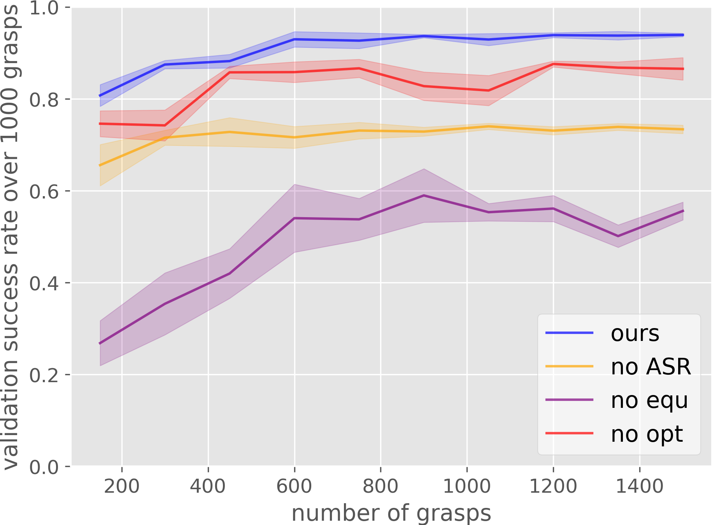
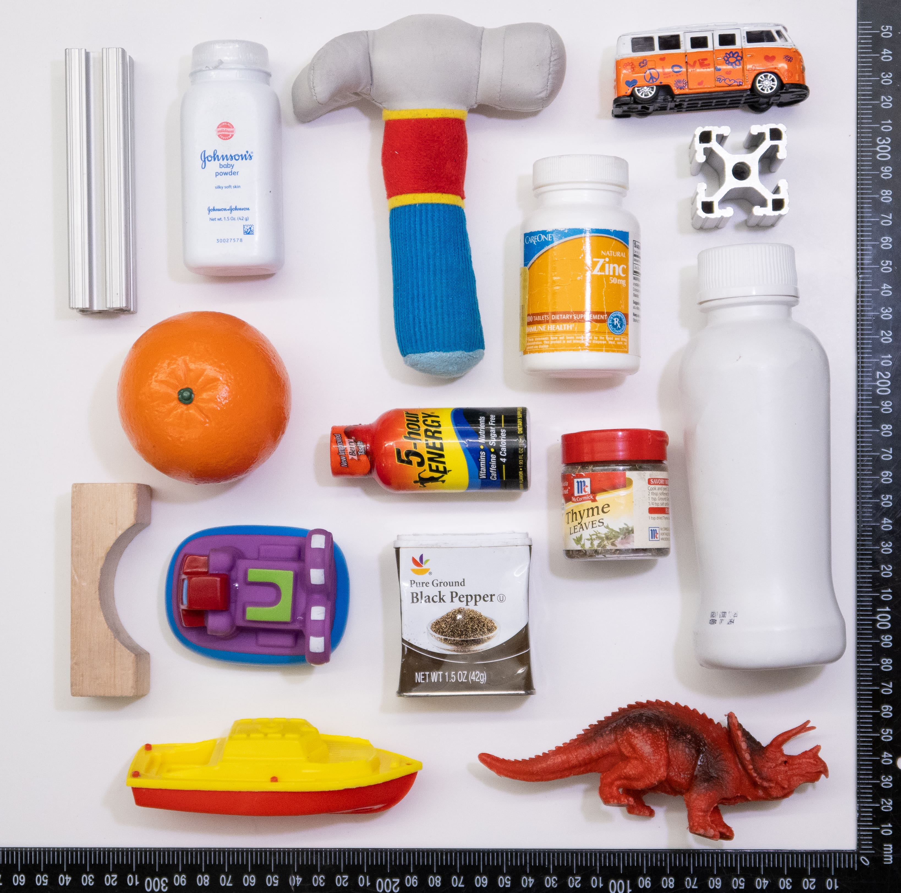

[Xupeng Zhu](https://zxp-s-works.github.io/), [Dian Wang](https://pointw.github.io), [Ondrej Biza](https://sites.google.com/view/obiza), [Guanang Su](),
[Robin Walters](http://mathserver.neu.edu/robin/), [Robert Platt](http://www.ccs.neu.edu/home/rplatt/)

## Citation

---

```
@misc{zhu2022sample,
      title={Sample Efficient Grasp Learning Using Equivariant Models}, 
      author={Xupeng Zhu and Dian Wang and Ondrej Biza and Guanang Su and Robin Walters and Robert Platt},
      year={2022},
      eprint={2202.09468},
      archivePrefix={arXiv},
      primaryClass={cs.RO}
}
```

## Idea

---
We formulate the planar grasp problem as a contextual bandit problem and use Q learning to learn a policy.

+ Augmented state representation (ASR)

<p align="center">
  
</p>

The action space for planar grasp is in 3-dimension (translation along x, y axle, and rotation along z axle). It is
difficult to evaluate the entire action space in one pass for a single neural network. We instead factorize the evaluation
 into translation part and rotational part by q1 and q2 networks.

+ Equivariant neural networks (Equ)

<p align="center">
 
 
</p>

We recognize that the optimal planar grasp function is SE(2)-equivariant. We use equivariant neural networks to approximate
 the SE(2)-equivariant grasp function.

+ Optimizations for the contextual bandit problem (Opt)

First, we adapt the loss function in ASR so that the target for the q1 network is more accurate. Second, we add an off-policy
learning loss to minimize the gap between q1 and q2 networks. Moreover, we use Boltzmann exploration to explore the action
 space based on the learned q value.


## Alation study

---

<p align="center">
  
</p>

In the ablation study (the right figure), each component of our method is ablated to show its importance. We train each 
ablation baseline in pybullet simulation and evaluate the learned policy at the grasp 150, 300, etc.


## The Robot Training Platform

---

<p align="center">
 
 
 
</p>


All training happens using the 15 objects shown in the middle figure. After training, we evaluate grasp performance on 
the 15 test objects shown in the right figure. Note that the test set is novel with respect to the training set.

At the beginning of training, the 15 training objects are dropped into one of the two trays
by the human operator. Then, we train by attempting to grasp these objects and place them in the other bin. All grasp
attempts are generated by the contextual bandit. When all 15 objects have been transported in this way, training switches
to attempting to grasp from the other bin and transport them into the first. Training continues in this way until 600
grasp attempts have been performed (that is 600 grasp attempts, not 600 successful grasps). A grasp is considered
to be successful if the gripper remains open after closing stops due to a squeezing force. To avoid systematic bias in
the way the robot drops objects into a tray, we sample the drop position randomly from a Gaussian distribution centered
in the middle of the receiving tray.


## The Learned Policy

---

In the simulation, after 1500 grasps training, our equivariant model converges to the grasp success rate of 93.9%.

In the robot, after 600 grasps training, our equivariant model achieves a grasp success rate of 95%.


## Video

---

<p align="center">
<iframe id="player" src="https://www.youtube.com/embed/au59crsgiKw" allowfullscreen></iframe>
</p>


[View this site in GitHub](https://github.com/ZXP-S-works/equivariant_grasp_site/edit/master/index.md)

